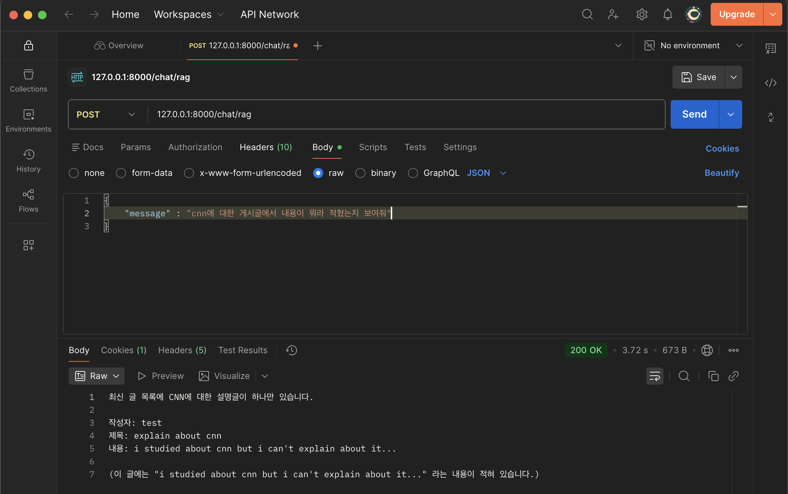
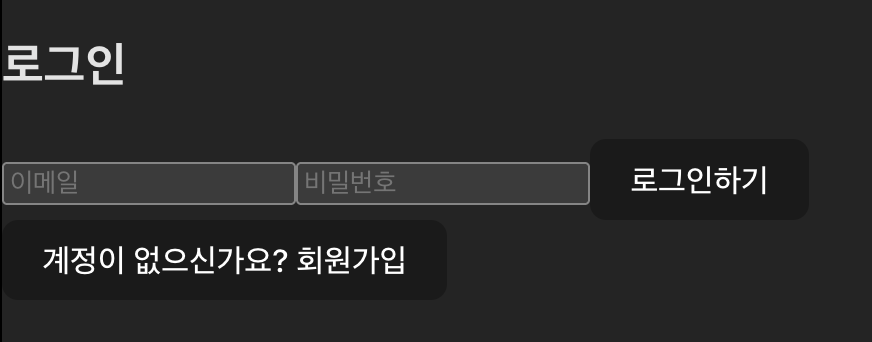
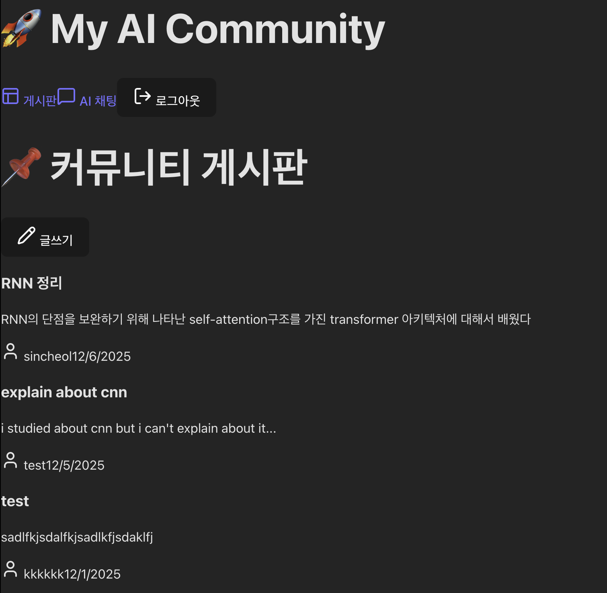
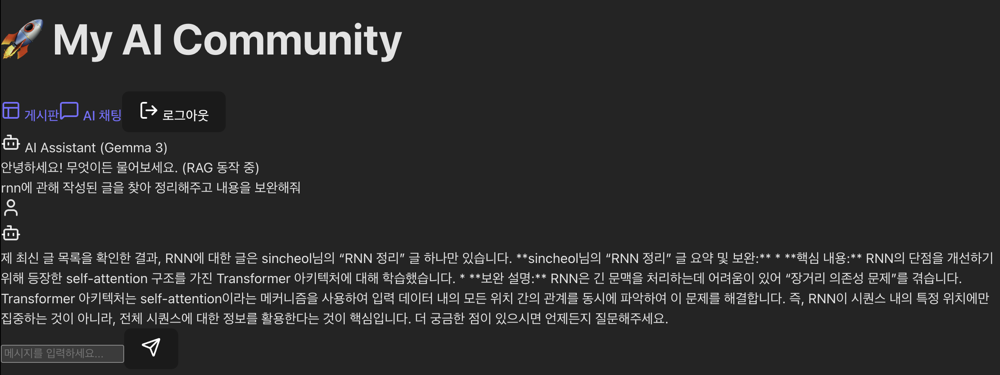
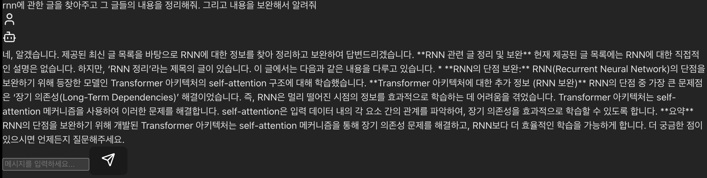
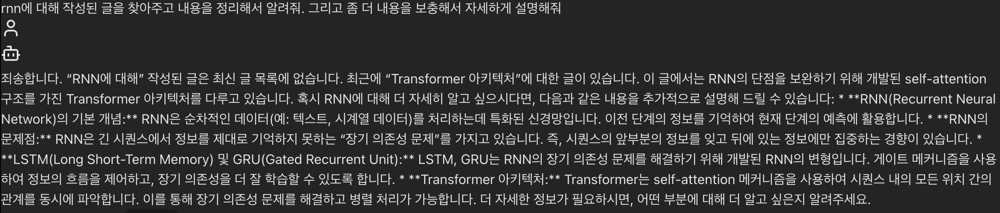
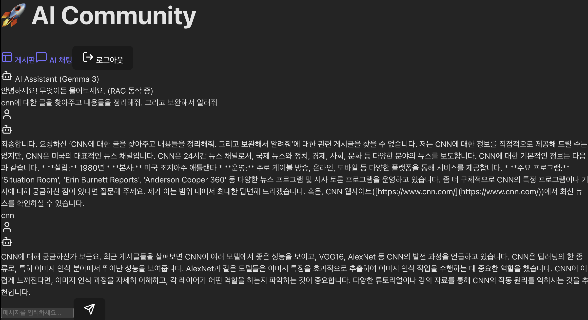
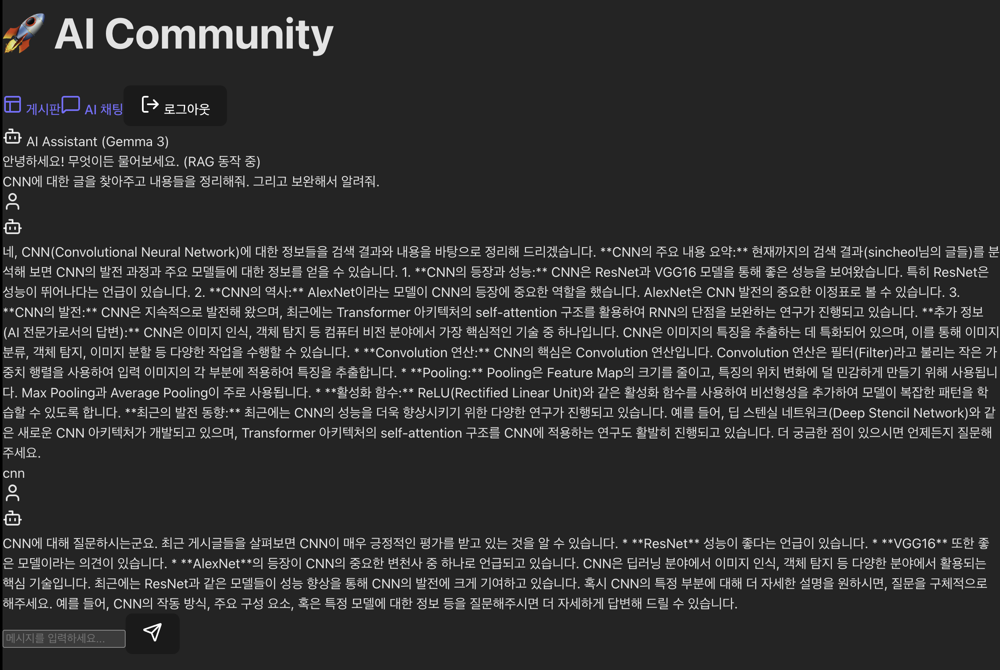

🚀 AI-Powered Community Backend Project (React + FastAPI + Ollama)

이 프로젝트는 FastAPI로 백엔드와 **Local LLM (Gemma 3)**을 활용한 RAG 챗봇 서비스를 구현하고, 이를 React(Vite)기반의 프론트엔드로 완성한 풀스택 프로젝트입니다.

AI 정보 공유 게시판을 통해 사용자들이 정보를 공유할 수 있습니다.

챗봇 서비스를 통해 LLM모델이 게시글들을 정리하고, 부족한 내용들을 보완해 설명해 줄 수 있습니다.

해당 프로젝트는 기초적인 웹사이트이지만, AI관련 기능(RAG)에 좀 더 초점을 두었습니다.

!정확히는 Lexical RAG이지만 DB를 postgres로 변경해 Keyword + Vector : Hybrid RAG까지 구현할 예정입니다!

🏗️ 아키텍처 및 폴더 구조

Router-Controller-Model의 계층형 아키텍처를 준수했습니다.

```
📦 Project Root
├── 📂 backend/                  # [Backend] FastAPI Server
│   ├── main.py                  # CORS 설정 및 앱 진입점
│   ├── 📂 router/               # API 라우팅 (Auth, Post, Chat)
│   ├── 📂 controller/           # 비즈니스 로직 및 예외 처리
│   ├── 📂 model/                # DB 쿼리 및 RAG 검색 로직
│   └── 📂 database/             # DB 연결 설정
│
├── 📂 frontend/                 # [Frontend] React Client
│   ├── 📂 src/
│   │   ├── 📂 components/       # UI 컴포넌트 (Auth, Board, Chat)
│   │   ├── App.jsx              # 라우팅 및 전역 상태 관리
│   │   └── index.css            # Tailwind 설정
│   └── vite.config.js           # Vite 설정
│
└── 📄 README.md                 # 프로젝트 문서
```

✨ 핵심 구현 기능

1. 사용자 경험 중심의 프론트엔드 (React)

SPA 구현: react-router-dom을 사용하여 페이지 새로고침 없이 부드러운 화면 전환을 구현.

실시간 AI 응답 (Streaming): ReadableStream을 활용하여 백엔드에서 오는 AI 답변을 한 글자씩 타자기처럼 출력하는 효과를 구현, 대기 시간의 지루함을 없앰.

통합 인증 관리: 로그인/회원가입 상태를 전역에서 관리하며, 세션 쿠키를 통해 안전하게 API 통신을 수행.

2. 강력한 백엔드 (FastAPI)

계층형 아키텍처: Router → Controller → Model 구조를 엄격히 지켜 유지보수성을 높임.

CORS & 보안: 프론트엔드([localhost]http://127.0.0.1:5173) 와 백엔드([localhost]http://127.0.0.1:8000) 간의 통신을 위해 CORS를 설정하고, SameSite 쿠키 정책을 준수.

3. RAG 기반 AI 챗봇

문맥 인식: 사용자가 질문하면 DB에서 관련 게시글을 검색(Retrieval)하여 프롬프트를 증강(Augmented).

Gemma 3 활용: 로컬 LLM인 Gemma 3에게 "커뮤니티 전문가, AI 전문가"라는 페르소나를 부여하여 한국어로 자연스러운 답변을 생성.


🚀 설치 및 실행 가이드

Step 1. 백엔드 실행 (Terminal 1)

cd backend
```
# 1. 라이브러리 설치
pip install fastapi uvicorn mysql-connector-python ollama

# 2. 서버 실행 (localhost:8000)
uvicorn main:app --reload
```

Step 2. 프론트엔드 실행 (Terminal 2)
```
cd frontend

# 1. 의존성 설치
npm install

# 2. 개발 서버 실행 (localhost:5173)
npm run dev
```

👉 브라우저에서 http://localhost:5173 으로 접속

Step 3. Database 설정
```
CREATE DATABASE user_info;

USE user_info;
```
-- 사용자 테이블
```
CREATE TABLE users (
    id INT AUTO_INCREMENT PRIMARY KEY,
    email VARCHAR(100) NOT NULL UNIQUE,
    password VARCHAR(255) NOT NULL,
    nickname VARCHAR(50) NOT NULL
);
```

-- 게시글 테이블
```
CREATE TABLE posts (
    post_id INT AUTO_INCREMENT PRIMARY KEY,
    user_id INT NOT NULL,
    title VARCHAR(200) NOT NULL,
    content TEXT NOT NULL,
    created_at TIMESTAMP DEFAULT CURRENT_TIMESTAMP,
    FOREIGN KEY (user_id) REFERENCES users(id)
);
```

3. 서버 실행

# 필요한 라이브러리 설치
pip install fastapi uvicorn mysql-connector-python ollama streamlit

# FastAPI 서버 실행
uvicorn main:app --reload


Swagger UI 접속: http://127.0.0.1:8000/docs 에서 모든 API를 테스트할 수 있습니다.


🎯 최종 목표 및 향후 계획 (Future Roadmap)

+비밀번호 유효성 검사를 추가해야 함.

+사용자의 정보 수정관리 추가해야 함(탈퇴 포함).

+게시글 수정 추가해야 함.

+mysql -> PostgreSQL로 바꿀 예정(벡터 데이터활용)

query문 업데이트를 통해 'chat에서 최신글 5개' -> '해당 키워드가 포함된 게시글을 가져오는 것으로 수정'

향후 query문을 업데이트, 좀 더 무거운 모델을 통해 사용자의 질문에 대한 게시글만 가져와 내용을 더 보강해서 대답하게 만들 예정..

아래는 backend api와 front end를 추가해 실험한 사진.

[BackEnd 질문에 대한 답변]



### v0.1 - Front End 추가!

초기 로그인 화면 :


게시글 목록 :


괜찮은 답변을 하는 케이스 :




글을 읽었지만 못찾는다는 답변을 하는 이상한 케이스.. :


### v0.2 - 사용자의 질문 자체를 게시글에서 검색해 답변:

(질문을 명사로 해야 먹힘..)  


### v0.3 - 사용자의 질문에서 명사를 뽑아내 게시글에서 검색해 답변 :
(!v0.2에서 답변하지 못한 것을 제대로 답변!)
